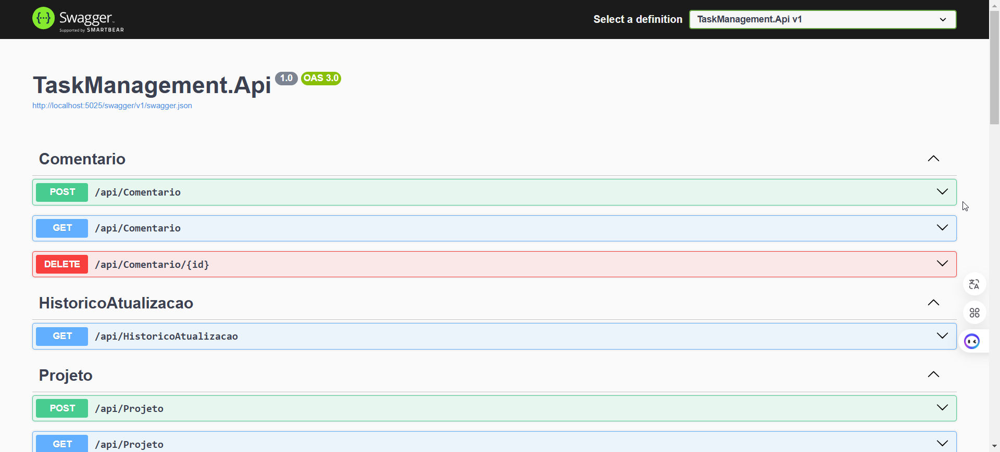
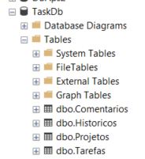

docker-compose up --build

# API Tasks

## Descrição

A **API Tasks** é uma aplicação ASP.NET Core (.NET 8.0) que fornece um serviço RESTful para gerenciamento de tarefas por Projeto. A API permite operações CRUD (Criar, Ler, Atualizar e Excluir) em projetos, tarefas e comentários.

## Requisitos

- .NET 8.0
- SQL Server
- Docker
- DBeaver ou SSMS (Para execução de scripts SQL ou consultas)
- Visual Studio 2022
- VsCode

## Estrutura do Projeto

```bash
- src/
  - Application/      -> Contém casos de uso (Handlers, Commands, Queries)
  - Domain/           -> Contém entidades e regras de negócio
  - Infrastructure/   -> Contém persistência e implementações técnicas (EF Core, NLog, etc.)
  - Presentation/     -> Contém controllers e mapeamento de endpoints
  - CrossCutting/     -> Contém Helpers que podem realizar Cross na Solution
- tests/
  - UnitTests/        -> Testes unitários
- scripts/
  - sql               -> Contém o script Seed para popular a versão inicial
  - postman           -> Contém o json para importat o projeto no POSTMAN para testes
- docker-compose.yml  -> Arquivo para subir a API e o SQL Server no Docker
- Dockerfile          -> Arquivo Docker para a API
- README.md           -> Instruções do projeto
```

## Preparação do ambiente

### Local - Profile: (http)

Na opção Local, a API roda na perfil http a partir do endereço: **http://localhost:5025/swagger/index.html**



Em relação ao Entity, para não perdermos tempo com criação de tabelas o migration foi preparado para rodar toda vez.
Sendo assim, a primeira vez pode demorar, as demais serão tranquilas após criação do Banco de Dados.




### Utilizando Docker

Na opção por Docker, será necessário rodar os seguinte comando a partir da pasta raiz do projeto Api:


```bash
docker-compose up --build

docker-compose down --rmi all

docker-compose down --volumes

docker run --network host -p 51000:51000 api-tasks-taskapi

```

Ao final da execução, a API e o banco de dados SQL Server estará disponivel.

```diff
- Caso o Banco de dados ProductCatalogDb não tenha sido criado com a última instrução, será necessário criar manualmente antes do Migration
```

### Realizar Migration Inicial manualmente

Na pasta "Products.Catalogs" execute a instrução:

```bash
dotnet ef migrations add InitialMigration --output-dir Migrations --project ./Products.Catalogs.Infrastructure.Repository/Products.Catalogs.Infrastructure.Repository.csproj --context ProductDbContext --startup-project ./Products.Catalogs.Api/Products.Catalogs.Api.csproj -v
```

Ao concluir, a mensagem `"Done. To undo this action, use 'ef migrations remove'"` será exibida.
Em seguida, execute a instrução:

```bash
dotnet ef database update --project ./Products.Catalogs.Infrastructure.Repository/Products.Catalogs.Infrastructure.Repository.csproj --context ProductDbContext
```
Ao concluir, a mensagem `"Done."` será exibida.

### Carga de dados para testes

Abra o SGBD de sua preferência e execute a instrução:

```sql
INSERT INTO Products (Id, Name, Description, Price, StockQuantity) VALUES
('e7f5d5b7-cb8a-4b3b-8346-bd9f27a6f9bb', 'Laptop Gamer', 'Laptop com placa de vídeo dedicada e processador Intel i7', 4500.99, 25),
('c8a4b6fa-1b62-4fdc-82ea-afa9b054c792', 'Smartphone Pro Max', 'Smartphone com tela OLED e câmera de 108MP', 2999.49, 50),
('a2b33e9d-ecb1-4f9f-8a83-3f32bc7b67a7', 'Monitor UltraWide', 'Monitor de 34 polegadas UltraWide para produtividade', 1999.90, 15),
('f9e3a291-d029-4184-9a87-2bba2f237b8a', 'Teclado Mecânico', 'Teclado mecânico RGB com switches Cherry MX', 499.99, 120),
('b6d1a7d5-6f34-432e-8bfc-8e4f92068a21', 'Mouse Gamer', 'Mouse com sensor óptico de 16.000 DPI', 249.90, 80),
('d04af3e8-3d14-4e56-9a58-6559d5fc7e6e', 'Fone de Ouvido Bluetooth', 'Fone de ouvido com cancelamento de ruído ativo', 799.99, 60),
('fb3e762c-9173-4a94-bae2-bd8d65f04f59', 'SSD 1TB', 'SSD NVMe com velocidade de leitura de até 3500MB/s', 749.90, 100),
('ac57e2c3-88c4-4b7b-900e-9fd94d8344a3', 'Smartwatch', 'Relógio inteligente com monitoramento de atividades físicas', 899.90, 40),
('5c3a9e36-8d56-4c9e-8744-54ea7c9eae3a', 'Cadeira Gamer', 'Cadeira ergonômica com ajuste de altura e inclinação', 1299.99, 30),
('84b9b8a0-b83e-4041-9d9e-4b7de5f98b7a', 'Headset Gamer', 'Headset com som surround 7.1 e microfone removível', 349.90, 45);
```
## Preparação da API

### Carregando a instância da API no Docker

Na pasta "Products.Catalogs" execute a instrução para gerar a imagem:


```bash
docker build -t products-catalogs .
```

Ao término da criação da imagem, execute a API utilizando a seguinte instrução:

```bash
docker run -d -p 51000:51000 --name products-catalogs-api products-catalogs 
```

## Preparação da aplicação (Front)

Na pasta "WebApplicationProducts" está a aplicação que conecta na API.
```diff
- A partir desse ponto interrompi as configurações do Docker. Ver notas em Considerações finais.
```

## Considerações Finais

Como minha máquina é da empresa para qual prestava serviço, estou com algumas limitações de configurações por não ter acesso como administrador da máquina.
Dessa forma, resolvi interromper aqui o README, mas, fico a disposição caso queiram tirar dúvidas a respeito do projeto.
