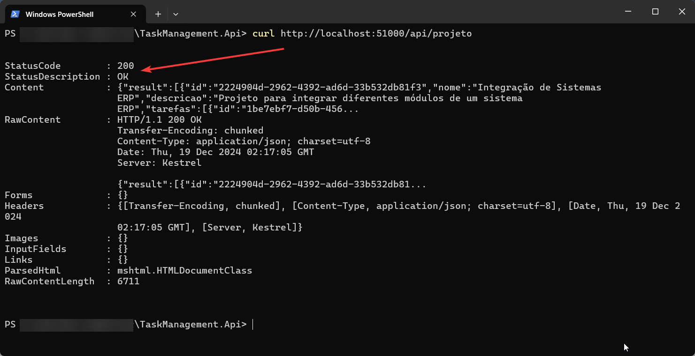
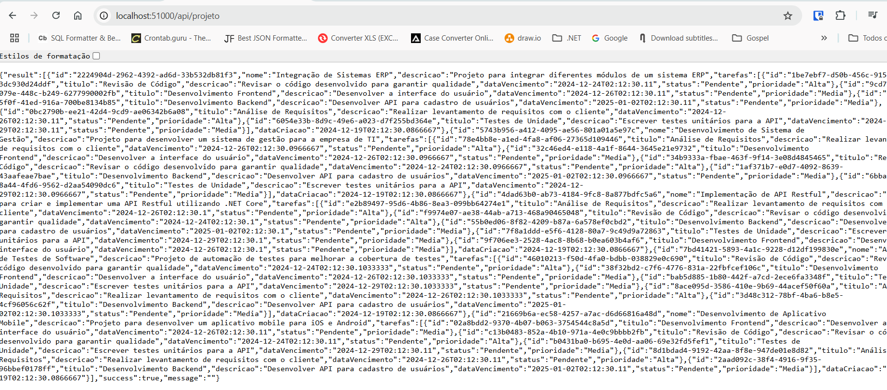

# API Tasks

## Descrição

A **API Tasks** é uma aplicação ASP.NET Core (.NET 8.0) que fornece um serviço RESTful para gerenciamento de tarefas por Projeto. A API permite operações CRUD (Criar, Ler, Atualizar e Excluir) em projetos, tarefas e comentários.

## Requisitos

- .NET 8.0
- SQL Server
- Docker
- DBeaver ou SSMS (Para execução de scripts SQL ou consultas)
- Visual Studio 2022
- VsCode

## Estrutura do Projeto

```bash
- src/
  - Application/      -> Contém casos de uso (Handlers, Commands, Queries)
  - Domain/           -> Contém entidades e regras de negócio
  - Infrastructure/   -> Contém persistência e implementações técnicas (EF Core, NLog, etc.)
  - Presentation/     -> Contém controllers e mapeamento de endpoints
  - CrossCutting/     -> Contém Helpers que podem realizar Cross na Solution
- tests/
  - UnitTests/        -> Testes unitários
- scripts/
  - sql               -> Contém o script Seed para popular a versão inicial
  - postman           -> Contém o json para importat o projeto no POSTMAN para testes
- docker-compose.yml  -> Arquivo para subir a API e o SQL Server no Docker
- Dockerfile          -> Arquivo Docker para a API
- README.md           -> Instruções do projeto
```

## Preparação do ambiente

### Local - Profile: (http)

Na opção Local, a API roda na perfil http a partir do endereço: **http://localhost:5025/swagger/index.html**


Em relação ao Entity, para não perdermos tempo com criação de tabelas o migration foi preparado para rodar toda vez.
Sendo assim, a primeira vez pode demorar, as demais serão tranquilas após criação do Banco de Dados.


### Utilizando Docker

Na opção por Docker, será necessário rodar os seguinte comando a partir da pasta raiz do projeto:

```bash
docker-compose up --build
```

Após o término do processo de build, a aplicação pode ser rodada via script:

```bash
curl http://localhost:51000/api/projeto
```


Ou, você pode testar o método GET, direto do navegador:



### Banco de Dados

Pensando em facilitar a avaliação, foi implementado na aplicação um método para forçar a migration na primeira execução. Dessa forma, o Analista não precisa de preocupar com o conjunto de tabelas iniciais.
`"Contudo, entretanto, toda via"`, foi deixado na pasta **./scripts/sql** um script de seed para popular as tabelas.

```sql
-- Criando tabelas temporárias para armazenar os IDs dos Projetos e Tarefas
DECLARE @Projetos TABLE (Id UNIQUEIDENTIFIER, Nome NVARCHAR(100));
DECLARE @Tarefas TABLE (Id UNIQUEIDENTIFIER, ProjetoId UNIQUEIDENTIFIER, Titulo NVARCHAR(100));

-- ==============================
-- Inserção de Projetos
-- ==============================
INSERT INTO Projetos (Id, Nome, Descricao, DataCriacao)
OUTPUT INSERTED.Id, INSERTED.Nome INTO @Projetos(Id, Nome)
VALUES
(NEWID(), 'Desenvolvimento de Sistema de Gestão', 'Projeto para desenvolver um sistema de gestão para a empresa de TI', GETUTCDATE()),
(NEWID(), 'Implementação de API Restful', 'Projeto para criar e implementar uma API Restful utilizando .NET Core', GETUTCDATE()),
(NEWID(), 'Automação de Testes de Software', 'Projeto de automação de testes para melhorar a cobertura de testes', GETUTCDATE()),
(NEWID(), 'Desenvolvimento de Aplicativo Mobile', 'Projeto para desenvolver um aplicativo mobile para iOS e Android', GETUTCDATE()),
(NEWID(), 'Integração de Sistemas ERP', 'Projeto para integrar diferentes módulos de um sistema ERP', GETUTCDATE());

-- ==============================
-- Inserção de Tarefas Dinâmicas
-- ==============================
DECLARE @ProjetoId UNIQUEIDENTIFIER;

DECLARE ProjetoCursor CURSOR FOR
SELECT Id FROM @Projetos;

OPEN ProjetoCursor;
FETCH NEXT FROM ProjetoCursor INTO @ProjetoId;

WHILE @@FETCH_STATUS = 0
BEGIN
    INSERT INTO Tarefas (Id, Titulo, Descricao, DataVencimento, Status, Prioridade, ProjetoId)
    OUTPUT INSERTED.Id, INSERTED.ProjetoId, INSERTED.Titulo INTO @Tarefas(Id, ProjetoId, Titulo)
    VALUES
    (NEWID(), 'Análise de Requisitos', 'Realizar levantamento de requisitos com o cliente', DATEADD(DAY, 7, GETUTCDATE()), 'Pendente', 'Alta', @ProjetoId),
    (NEWID(), 'Desenvolvimento Backend', 'Desenvolver API para cadastro de usuários', DATEADD(DAY, 14, GETUTCDATE()), 'Pendente', 'Média', @ProjetoId),
    (NEWID(), 'Testes de Unidade', 'Escrever testes unitários para a API', DATEADD(DAY, 10, GETUTCDATE()), 'Pendente', 'Média', @ProjetoId),
    (NEWID(), 'Revisão de Código', 'Revisar o código desenvolvido para garantir qualidade', DATEADD(DAY, 5, GETUTCDATE()), 'Pendente', 'Alta', @ProjetoId),
    (NEWID(), 'Desenvolvimento Frontend', 'Desenvolver a interface do usuário', DATEADD(DAY, 7, GETUTCDATE()), 'Pendente', 'Média', @ProjetoId);

    FETCH NEXT FROM ProjetoCursor INTO @ProjetoId;
END;

CLOSE ProjetoCursor;
DEALLOCATE ProjetoCursor;

-- ==============================
-- Inserção de Comentários Dinâmicos
-- ==============================
DECLARE @TarefaId UNIQUEIDENTIFIER;
DECLARE @RandomComments TABLE (Comentario NVARCHAR(255));
INSERT INTO @RandomComments VALUES
('Ótimo progresso até agora!'),
('Revisar a documentação antes de prosseguir.'),
('Atenção aos prazos de entrega.'),
('Discussão pendente com o cliente sobre este item.');

DECLARE TarefaCursor CURSOR FOR
SELECT Id FROM @Tarefas;

OPEN TarefaCursor;
FETCH NEXT FROM TarefaCursor INTO @TarefaId;

WHILE @@FETCH_STATUS = 0
BEGIN
    DECLARE @CommentIndex INT = 1;

    WHILE @CommentIndex <= 3 -- Gera de 1 a 3 comentários por tarefa
    BEGIN
        INSERT INTO Comentarios (Id, TarefaId, Comentario, DataCriacao)
        SELECT NEWID(), @TarefaId, Comentario, GETUTCDATE()
        FROM @RandomComments
        WHERE Comentario = (SELECT TOP 1 Comentario FROM @RandomComments ORDER BY NEWID());

        SET @CommentIndex = @CommentIndex + 1;
    END;

    FETCH NEXT FROM TarefaCursor INTO @TarefaId;
END;

CLOSE TarefaCursor;
DEALLOCATE TarefaCursor;

-- ==============================
-- Resultado Final
-- ==============================
SELECT * FROM Projetos;
SELECT * FROM Tarefas;
SELECT * FROM Comentarios;

```

### POSTMAN

Para quem gosta de usar POSTMAN, foi criado uma collection na pasta **./scripts/postman**. Ao importar a collection você terá toda a facilidade e praticidade para testar a API.

## Refinamento - Perguntas ao PO

**1. Relatórios e Análises**
- O modelo atual de relatórios de desempenho está adequado ou precisamos de mais métricas e insights?
- Deve ser possível exportar os relatórios de desempenho para formatos como Excel ou PDF?
- Você gostaria de permitir que os usuários filtrassem ou personalizassem os relatórios, como por data ou tipo de tarefa?

**2. Segurança e Autenticação**
- A adição de autenticação e autorização (como login e gestão de usuários) é algo que você considera importante nesta nova versão?
- Deve haver diferenciação de acessos (por exemplo, usuários com papéis de "gerente" com permissões especiais)?

**3. API e Integrações**
- Há planos para integrar a API com outros sistemas ou ferramentas (como Slack, Trello, Google Calendar)?
- Deveríamos criar endpoints adicionais para a manipulação de tarefas e projetos, como filtros ou pesquisa avançada?

**4. Histórico e Comentários**
- Deve ser possível pesquisar e filtrar o histórico de alterações para facilitar o acompanhamento das atualizações nas tarefas?
- Há algum tipo de dados adicionais que você gostaria de armazenar no histórico de tarefas (como versões anteriores ou anexos)?
- A funcionalidade de comentários nas tarefas é suficiente ou você gostaria de incluir recursos como anexos, reações ou menções a outros usuários?

**5. Manutenção e Suporte**
- Como a manutenção do sistema deve ser feita em termos de atualizações de tarefas e projetos, dados e usuários?
- Há planos para permitir que os usuários recuperem tarefas ou projetos excluídos acidentalmente?
- Seria útil ter uma funcionalidade de backup e restauração para os dados?

**6. Desafios ou Feedback dos Usuários**
- Qual o feedback mais comum dos usuários sobre a versão atual?
- Quais são as maiores dificuldades enfrentadas pelos usuários para gerenciar suas tarefas ou projetos?
- Existem reclamações específicas sobre bugs ou falhas recorrentes na versão atual?

## Considerações Finais

Gostei do tipo de desafio, pois, fez eu explorar áreas conhecidas expandido um pouco mais o conhecimento.
Por padrão, sempre utilizo:
- Pattern CQRS
- AutoMapper
- FluentValidation
- NLog
- Mediator
- Entity Framework
- SQL Server
- Xunit
- Postman
- Swagger
- IoC

Pois, considero que projetos robustos em C# devam seguir por parte desse caminho, salvo as possíveis variações de banco de dados, serviços externos e demais considerações.
Fico a disposição.
